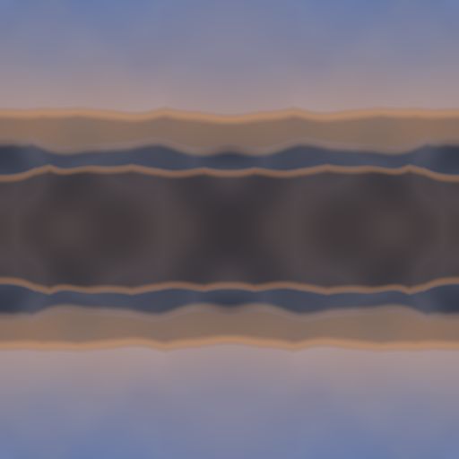
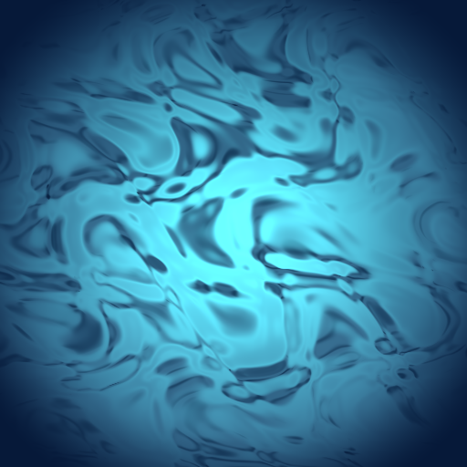
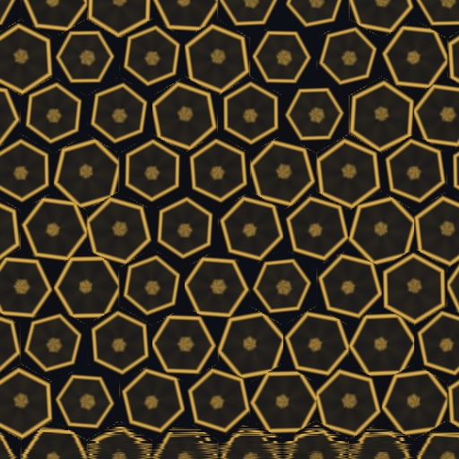

# LoopLab

LoopLab is an editor-first Unity tool for generating short, seamless visual loops locally. The project is built for fast look development, deterministic iteration, and reusable exports that can be dropped into reels, portfolio case studies, motion backplates, or UI experiments without introducing any online dependency.

## At a Glance

- Unity version: `6000.3.7f1`
- Render pipeline: URP `17.3.0`
- Main menu entry: `Precondition/LoopLab`
- Sandbox scene: `Assets/Precondition/LoopLab/LoopLabSandbox.unity`
- Built-in presets: `Landscape`, `Fluid`, `Geometric`
- Export formats: GIF, plus MP4 when `ffmpeg` is available
- Runtime model: fully local, deterministic, editor-first

## Screenshots and Examples

These captures were generated from the current project using the graphics-backed showcase validation/export path, so they reflect the shipped presets rather than mocked-up marketing art.

<p align="center">
  
  
  
</p>

- `Landscape`: layered horizon bands driven by tiled terrain-style noise.
- `Fluid`: soft cyan flow field built from curl-like motion.
- `Geometric`: hex-grid motion study with deterministic orbiting accents.

Typical export names include the preset, contrast mode, seed, frame count, FPS, resolution, and timestamp, for example:

```text
looplab-landscape-high-seed1337-72f-24fps-512px-20260317-205153610.gif
```

## Requirements

- Unity `6000.3.7f1`
- A machine that can open the Unity editor locally
- Optional for MP4 export: `ffmpeg` on `PATH`, `LOOPLAB_FFMPEG_PATH`, or `FFMPEG_PATH`

## Setup

1. Clone the repository.
2. Open the project in Unity Hub with editor version `6000.3.7f1`.
3. Let Unity restore packages and import the project.
4. Open `Assets/Precondition/LoopLab/LoopLabSandbox.unity`.
5. Open the main tool from `Precondition/LoopLab`.
6. If the scaffold or preview assets look missing, run `Precondition/LoopLab/Rebuild Scaffold`.

The scaffold step ensures the expected folder structure exists, assigns the project branding, provisions the URP assets under `Assets/Precondition/LoopLab/Resources/Materials`, creates preview materials for each preset, and keeps the sandbox scene in build settings.

## Workflow

1. Open `Precondition/LoopLab`.
2. Choose a preset and adjust `FPS`, `Duration`, `Resolution`, and `Seed`.
3. Click `Generate` to freeze a validated loop state for preview, boundary QA, and export.
4. Use `Play` or `Pause` to scrub the loop in the window.
5. Switch between `Single` and `Tiled2x2` preview mode to check the seam visually.
6. Save working configurations with `Saved Presets` when you want to reload them later.
7. Export to GIF or MP4 once the generated state is current.

Important behavior notes:

- Preview can show live settings before a new generation pass, but exports always use the last generated settings.
- After changing controls, generate again before exporting. The window will block export when settings are pending.
- The default export destination is `Assets/Precondition/LoopLab/Exports`, but the window also accepts a custom folder.
- `Validate All Presets` writes boundary-check snapshots to `log/boundary-validation` in graphics-backed sessions.
- When Unity is running with `-nographics`, LoopLab now rejects placeholder-only visual captures and writes guidance to `log/boundary-validation/VISUAL-VALIDATION-README.md` instead.

## Portfolio-Facing Usage Notes

- Use `256` or `512` resolution for fast iteration and `1024` when capturing a cleaner hero loop.
- Keep the seed visible in filenames or captions so a chosen look can be regenerated later.
- Use `Tiled2x2` preview when you need to demonstrate that the loop closes cleanly at the seam.
- Treat the built-in presets as reusable visual directions:
  - `Landscape` for atmospheric horizon plates
  - `Fluid` for abstract motion backdrops
  - `Geometric` for graphic overlays and branded motion studies

## Architecture

### Editor Layer

- `Assets/Precondition/LoopLab/Editor/LoopLabWindow.cs`
  - Main window, menu entries, preview state, saved presets, export controls, and boundary-QA presentation.
  - Keeps both live `settings` and frozen `generatedSettings` so editing does not silently change a generated export.
- `Assets/Precondition/LoopLab/Editor/LoopLabProjectBootstrap.cs`
  - Rebuilds the scaffold, creates missing folders, provisions URP assets, refreshes preview materials, and ensures the sandbox scene exists.
- `Assets/Precondition/LoopLab/Editor/LoopBoundaryValidation.cs`
  - Compares frame `0` against the restart boundary and writes diff snapshots for QA.

### Runtime Layer

- `Assets/Precondition/LoopLab/Runtime/Core/LoopLabRenderSettings.cs`
  - Normalizes generation inputs such as FPS, duration, resolution, and seed.
- `Assets/Precondition/LoopLab/Runtime/Core/LoopPhase.cs`
  - Converts frame index or elapsed time into a periodic phase and loop vector.
- `Assets/Precondition/LoopLab/Runtime/Core/LoopRenderer.cs`
  - Loads the preset material, pushes generation parameters into the shader, and renders a square preview/export frame.
- `Assets/Precondition/LoopLab/Runtime/Core/LoopLabPresetCatalog.cs`
  - Maps preset kinds to display names, shaders, palette colors, and grid scale.
- `Assets/Precondition/LoopLab/Runtime/Shaders/*.shader`
  - House the actual looping visual logic for landscape, fluid, and geometric motion.

### Export Path

- GIF export lives in `Assets/Precondition/LoopLab/Editor/Export/GifExporter.cs` and `GifEncoder.cs`.
  - Frames are rendered through the same runtime renderer as preview.
  - GIF encoding supports configurable dithering.
- MP4 export lives in `Assets/Precondition/LoopLab/Editor/Export/Mp4Exporter.cs`.
  - The exporter writes a PNG sequence, then invokes `ffmpeg` to encode H.264 output.
- Shared export session utilities live in `Assets/Precondition/LoopLab/Editor/Export/LoopLabExportSupport.cs`.
  - Filenames encode the settings.
  - Temporary workspaces are staged and cleaned automatically.

## Seed Determinism and Loop Math

LoopLab is designed so the same validated settings reproduce the same generated loop.

- `LoopLabRenderSettings.GetValidated()` is the normalization boundary for generation and export.
- Seed `0` is converted to the default seed `1337`.
- Unsupported or out-of-range seeds are hashed into the stable range `1..16777215`.
- `RandomizeSeed()` is deterministic for a given input seed, which makes seed stepping reproducible rather than time-based.
- `LoopPhase` is shared across preview and export, so both sample the same normalized timeline.
- `Generate` freezes a validated copy of the current settings, which prevents later UI edits from drifting the export or boundary-QA result.

## Presets

- `Landscape`
  - Display name: `Landscape - Dawn Ridge`
  - Shader: `LoopLab/Landscape`
  - Best described as layered terrain silhouettes with a soft dawn palette.
- `Fluid`
  - Display name: `Fluid - Azure Vortex`
  - Shader: `LoopLab/Fluid`
  - Best described as an abstract cyan flow field.
- `Geometric`
  - Display name: `Geometric - Brass Lattice`
  - Shader: `LoopLab/Geometric`
  - Best described as a looping hex-cell motion pattern.

## Project Structure

```text
Assets/Precondition/LoopLab/
  Editor/        Editor window, scaffold bootstrap, validation, export tooling
  Runtime/       Render settings, phase math, renderer, presets, shaders
  Resources/     Preview materials and URP assets used by the renderer
  Exports/       Default export destination created by the tool
  LoopLabSandbox.unity
Assets/Precondition/LoopLab/Tests/EditMode/
  Render settings and GIF encoder tests
Packages/
  Unity dependencies, including URP
ProjectSettings/
  Unity project configuration and build settings
log/
  Batchmode validation logs and boundary-validation snapshots
```

## Validation and Useful Commands

Project import / compile check:

```bash
"/Applications/Unity/Hub/Editor/6000.3.7f1/Unity.app/Contents/MacOS/Unity" \
  -batchmode -nographics -projectPath "$PWD" -quit \
  -logFile "$PWD/log/unity-batchmode.log"
```

Boundary validation for all presets in graphics-backed batchmode:

```bash
"/Applications/Unity/Hub/Editor/6000.3.7f1/Unity.app/Contents/MacOS/Unity" \
  -batchmode -projectPath "$PWD" \
  -executeMethod Precondition.LoopLab.Editor.LoopBoundaryValidationBatch.RunAllPresets \
  -quit -logFile "$PWD/log/unity-boundary-validation.log"
```

If you accidentally run the boundary-validation command with `-nographics`, it now stops before writing placeholder PNGs and records the supported alternative in `log/boundary-validation/VISUAL-VALIDATION-README.md`.

Supported non-interactive visual validation, including showcase asset verification:

```bash
"/Applications/Unity/Hub/Editor/6000.3.7f1/Unity.app/Contents/MacOS/Unity" \
  -batchmode -projectPath "$PWD" \
  -executeMethod Precondition.LoopLab.Editor.Export.LoopLabShowcaseExporterBatchValidation.Run \
  -quit -logFile "$PWD/log/looplab-visual-validation.log"
```

Window workflow validation, including preset save/load, live preview behavior, and GIF export:

```bash
"/Applications/Unity/Hub/Editor/6000.3.7f1/Unity.app/Contents/MacOS/Unity" \
  -batchmode -projectPath "$PWD" \
  -executeMethod Precondition.LoopLab.Editor.LoopLabWindowBatchValidation.Run \
  -quit -logFile "$PWD/log/unity-window-validation.log"
```

MP4 validation when `ffmpeg` is available:

```bash
"/Applications/Unity/Hub/Editor/6000.3.7f1/Unity.app/Contents/MacOS/Unity" \
  -batchmode -projectPath "$PWD" \
  -executeMethod Precondition.LoopLab.Editor.LoopLabMp4ExporterBatchValidation.Run \
  -quit -logFile "$PWD/log/unity-mp4-validation.log"
```

## Assumptions and Limitations

- The tool is intentionally local and offline. There are no cloud services or remote generation dependencies.
- MP4 export depends on `ffmpeg`. If no executable is found, the window reports a clear error and does not write an output file.
- `LoopLabPresetCatalog.SupportsContrastMode()` currently returns `false`, so contrast mode is present in the data model but dormant in the shipped presets.
- Preset ScriptableObject types exist, but the current shipped look definitions are still driven primarily by `LoopLabPresetCatalog` plus the shaders.
- The repository now includes edit-mode tests, but it does not yet include a CI workflow.
